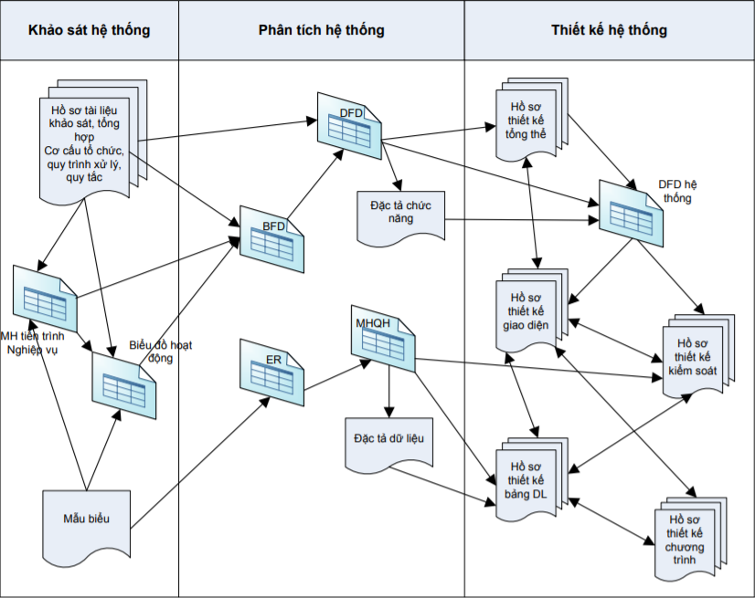

# Phương pháp phân tích

## Phương pháp tiếp cận
- Lịch sử phát triển: đi theo sự phát triển của máy tính, công nghệ(bộ nhớ tăng dần, ram tăng dần, )
    - __Hướng tiến trình:__ khi này máy tính dung lượng nhỏ, ram yếu. 
    - __Hướng dữ liệu:__ dung lượng tăng dần - lưu dữ liệu và các tiến trình cùng một chỗ để xử lý. tuy nhiên mỗi một phần gồm dữ liệu A và tiến trình A, không shared được cho B.
    - __Hướng cấu trúc:__ dung lượng tăng tiếp - dữ liệu được tập trung lại thành CSDL => giải quyết được việc các tiến trình chia sẻ dữ liệu. các tiến trình vẫn còn rời rạc, chưa liên kết lại với nhau. cần một giải pháp để giải quyết việc tái sử dụng => các tiến trình sẽ tạo nên các module. hay còn gọi là hướng cấu trúc.
    - __Hướng đối tượng:__ khi này các công ty phát triển lớn dần, dần muốn sử dụng, giao tiếp lẫn nhau => tạo ra các đối tượng độc lập, các đối tượng là riêng biệt, có thể liên kết hoặc cũng có thể tồn tại một cách độc lập. cần thì lắp vào, không cần thì tách ra.

    ==> Hiện tại hai phương hướng cấu trúc và đối tượng vẫn còn được sử dụng. khi tạo ra phần lõi - cấu trúc. khi các cấu trúc liên kết lại, lớn dần theo time => tạo thành các đối tượng.
    ==> Chú ý: Lập trình hướng đối tượng và phân tích thiết kế hướng đối tượng là khác nhau.
    ==> Vấn đề ta luôn phải đối mặt: sự phức tạp của hệ thống nở dần theo time.

## Mô hình hóa hệ thống <giúp việc tưởng tượng và hiểu về hệ thống dễ dàng hơn>

- Mức độ mô hình hóa:
    - Mức Logic: hệ thống làm cái gì: đưa ra các bước làm.
    - Mức vật lý: hệ thống làm việc đó như thế nào: các bước làm chi tiết, cụ thể.

- Các bước làm: khi thêm một chương trình nhỏ vào hệ thống lớn. hệ thống có rồi (chú ý: các thành phần trong 1 hệ thống thông tin)
    - khảo sát hệ thống - là khải sát các thành phần của hệ thống
        - quy trình
        - con người
        - thủ tục
        => Tìm câu trả lời cho việc: làm gì - liệt kê ra các công việc hệ thống cần làm, làm như thế nào - quy trình hoạt động ra sao.
        => Trong phân tích: ta sẽ lấy ra cái làm gì. vì quy trình hoạt động sẽ thay đổi(xem lại bài 1)
        Hệ thống mới(khi dùng CNTT) = làm gì (cũ) + làm như thế nào(hệ thống mới)
    - Mô tả lại các bước: <slide 1- trang 47>
        - Step 1: Hệ thống cũ làm gì
        - Step 2: Diễn tả hệ thống cũ làm cái gì

- Bốn góc nhìn hệ thống
    - Góc 1: các chức năng (khi phân tích)
    - Góc 2: dữ liệu (khi phân tích)
    - Góc 3: kiến trúc, các thành phần của hệ thống(máy tính, máy in, bao nhiêu máy, kết nối mạng không) (khi cài đặt)
    - Góc 4: khả năng áp dụng, động thái, sự tiến hóa phản ứng của hệ thống đáp ứng lại thực tế tác động (khi kiểm thử)
## Mô hình hóa hệ thống
- Mô hình hóa hệ thống - diễn đạt hệ thống lại bằng các mô hình
    - Mục đích:
        - Mô hình hóa để hiểu hệ thống: chỉ khi hiểu hệ thống mới trình bày được hệ thống, diễn đạt lại được hệ thống
        - Mô hình hóa để trao đổi
        - Mô hình hóa để hoàn chỉnh: khi nhìn vào mô hình - ta dễ dàng nhìn thấy điểm yếu của nó hơn
    - Tiêu chí cần đảm bảo khi xây dựng mô hình:
        - Dễ đọc, dễ hiểu, dễ trao đổi(phải có chuẩn chung - các kí hiệu nhất quán)
        - Xác thực, chặt chẽ, đầy đủ
        - Dễ thực hiện

- Ba thành phần của một phương pháp mô hình hóa

### Mô hình hóa hướng cấu trúc
- Sơ đồ và tài liệu

### Mô hình hóa hướng đối tượng

## Vòng đời phát triển của hệ thống thông tin

- Khởi tạo và lập teieesn trình
    - Khảo sát hệ thống thực
        - Nghiệp vụ cơ bản
        - Quy trình vật lý
    - Lập kế hoạc dự án
        - Dữ liệu thực
        - Xây dựng dự án khả thí
            - Kĩ thuật
            - Kinh tế
- Phân tích hệ thống    
    - Phân tích chức năng
        - Xác định chức năng hệ thống cần có
    - Phân tích dữ liệu: xác định dữ liệu của hệ thống
        
- Thiết kế hệ thống
    - Thiết kế logic: là bản thiết kế ngôn ngữ nào cũng sử dụng được
    - Thiết kế vật lý: đưa vào ngôn ngữ cụ thể
    - Giao diện
    - Thủ tục

## Nội dung môn học
- Tiến trình Phân tích thiết kế hệ thống
- Nội dung công việc
- Nội dung báo cáo
- Đề tài gợi ý
    - Đề tài cá nhân: phân tích và thiết kế một hệ thống thực hiện một công việc cụ thể.

## Nội dung công việc - word, visio
- Khảo sát hệ thống
    -                                                            

- Phân tích hệ thống
- Thiết kế hệ thống
- Demo
